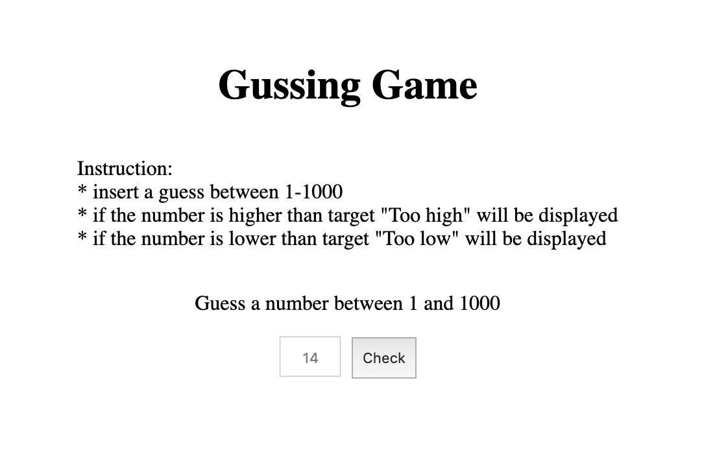
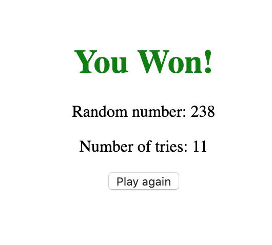
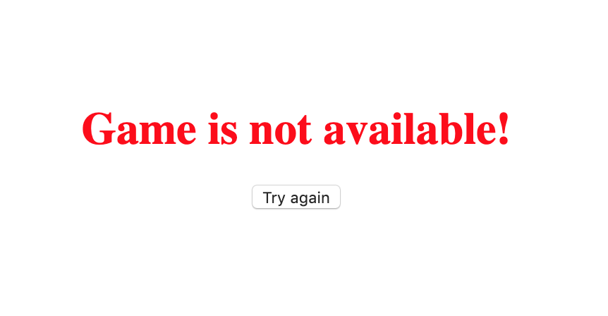

# guessing-game
Application is done by using React server side rendering
### How to run
In order to run the application on your local machine please following the instruction below in command line:
```bash
$ git clone https://gitlab.com/wahyufaturrizky/guessing-game-wahyu.git
$ cd guessing-game
$ npm i && npm run start
```

In HomePage you will find the instruction as the image below:




If you win, you will see the following image:



If server which generates random numbers fail, you will face the following error:

